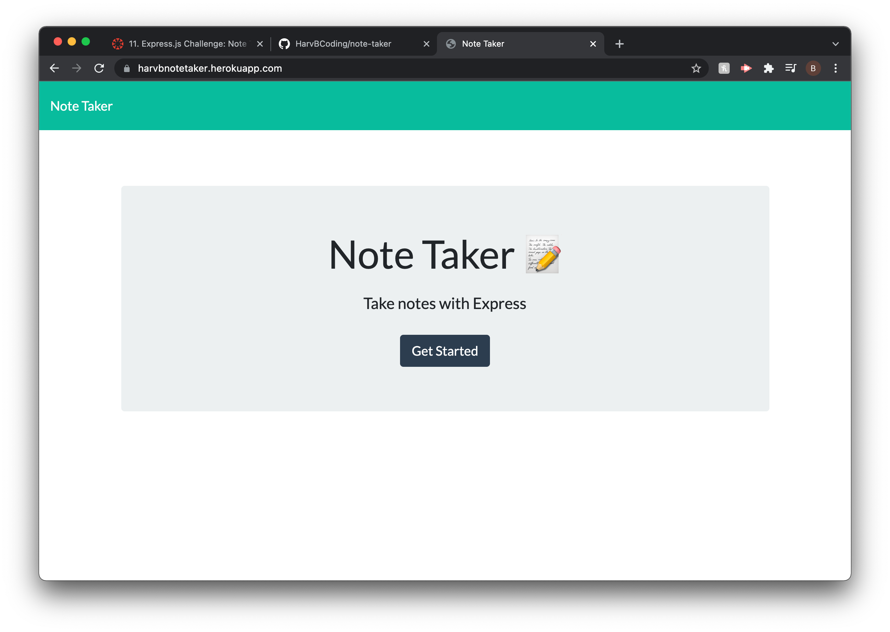
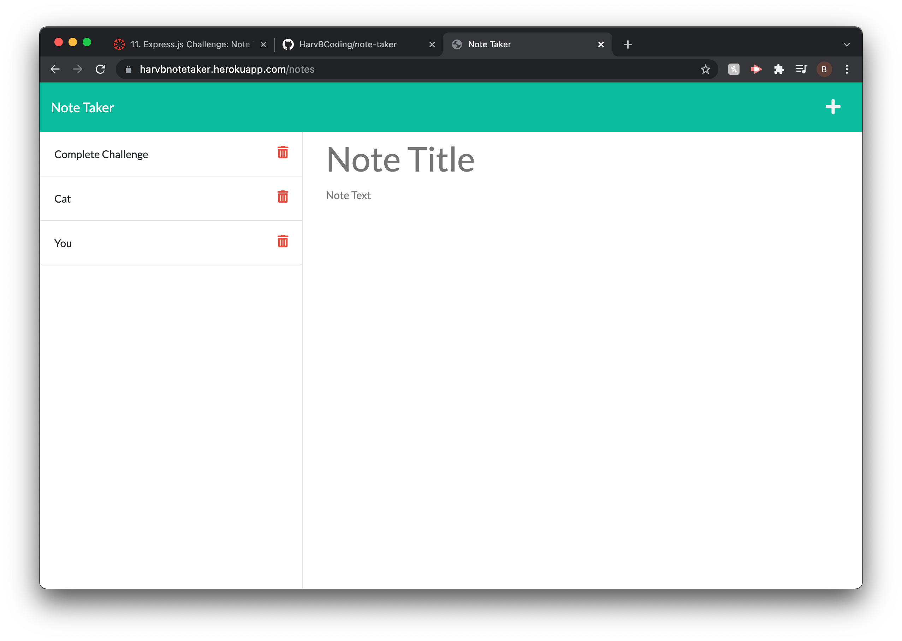
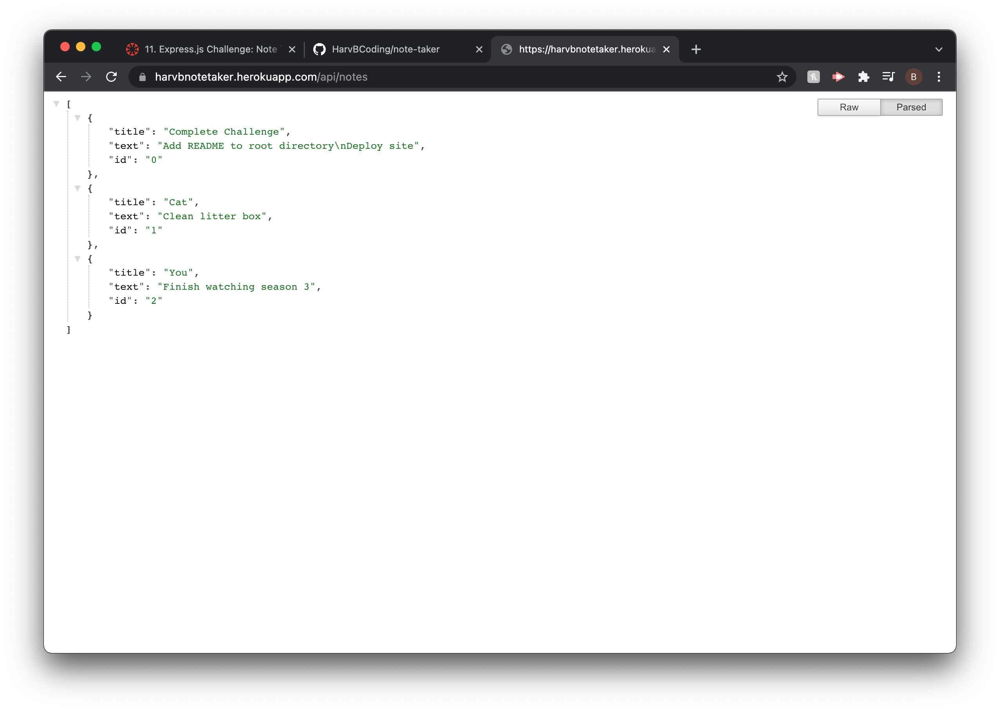

  # Note Taker
  

  ## Description
  An app that allows the user to jot their thoughts down, or create reminders for themselves by creating notes. The user can also save the notes, which will all display on the left hand side, and delete notes from the list.

  ## Table of Contents
  * [Installation](#installation-instructions)
  * [Usage](#usage)
  * [Contributions](#contributions)
  * [Tests](#tests)
  * [Questions](#questions)
  
  
  

  ## Installation Instructions
  No installation required navigate to [harvbnotetaker.heroku.com](https://harvbnotetaker.herokuapp.com/)

  ## Usage
  Click the "Get Started" button on the homepage and start jotting down your thoughts.

  
  ## Contributing
  I appreciate your interest in improving this project, however I am not accepting contributions at this time.
  

  
  ## Tests
 The following screenshots demonstrate functionality.
  
  
  

  ## Questions
  If you have any questions or need to report bugs please reach out to me at [HarvBCoding](https://www.github.com/HarvBCoding) or harvey.breania@gmail.com
  
  

